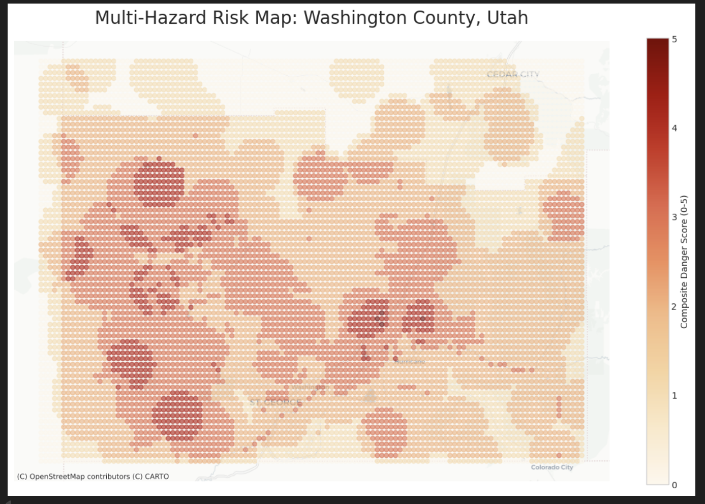
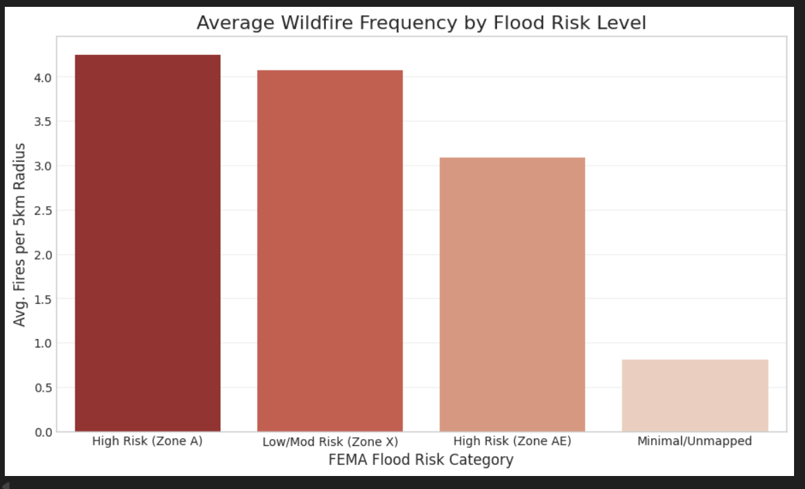
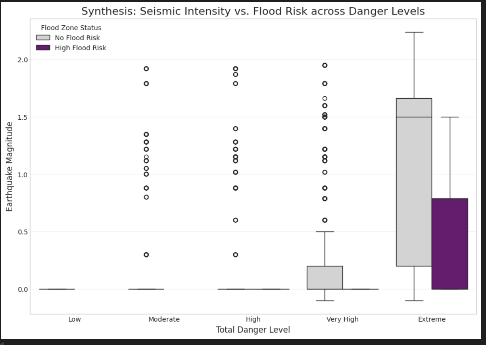

# Washington County Natural Hazard Analysis

This project analyzes and visualizes natural hazard data for Washington County, Utah, focusing on wildfires, earthquakes, and floods. The goal is to create a synthesized dataset that represents the composite hazard risk across a grid of locations in the county.

**Note:** While the project folder is named `wasiongton_hazards`, the analysis notebooks focus specifically on **Washington County, Utah**.

## Project Workflow

1.  **Data Acquisition & Cleaning (`hazard_analysis.ipynb`)**:
    *   Raw data for fires, earthquakes, and floods are loaded.
    *   Each dataset is filtered to the geographic bounds of Washington County.
    *   Data is cleaned, transformed, and new features are derived (e.g., binning acres burned or earthquake magnitude).
    *   Cleaned datasets for each hazard are saved to `data/processed/`.

2.  **Data Blending & Synthesis (`hazard_analysis.ipynb`)**:
    *   A grid of points is created to cover Washington County.
    *   Each hazard dataset is spatially joined with this grid to count events and assess risk at each point.
    *   A composite `danger_score` is calculated based on the presence and severity of different hazards.
    *   The final, blended GeoDataFrame is saved as `hazards_by_location_washington.geojson`.

3.  **Analysis & Visualization (`visualize_hazards.ipynb`)**:
    *   The synthesized dataset is loaded.
    *   A geospatial risk map is generated, plotting the danger score on a basemap.
    *   Statistical charts (bar plots, box plots) are created to analyze relationships between different hazards and risk levels.

## Key Visualizations

Below are the key visualizations produced by the `visualize_hazards.ipynb` notebook.

**1. Multi-Hazard Risk Map of Washington County**

This map shows the composite `danger_score` for each grid point across the county, plotted on a basemap to show geographic context. Higher scores indicate areas with a greater combination of hazard risks.



**2. Wildfire Frequency vs. Flood Risk**

This bar chart analyzes the relationship between the average number of wildfires and the designated FEMA flood risk zone for each location.



**3. Seismic Intensity vs. Flood Risk**

This box plot synthesizes three variables: the total danger level, the maximum earthquake magnitude, and whether a location is within a high-risk flood zone. It helps visualize how different hazard types interact.



## Project Structure

-   `data/raw/`: (Not included in repo) Contains the original raw data files for fires, earthquakes, and floods.
-   `data/processed/`: Contains the output of the data cleaning and synthesis process.
    -   `washington_fires_clean.geojson`: Cleaned wildfire data.
    -   `washington_earthquakes_clean.geojson`: Cleaned earthquake data.
    -   `washington_floods_clean.geojson`: Cleaned flood zone data.
    -   `hazards_by_location_washington.geojson`: The final synthesized dataset with a grid of points, hazard counts, scores, and danger levels.
-   `notebooks/`: Contains the Jupyter Notebooks.
    -   `hazard_analysis.ipynb`: The main data processing notebook.
    -   `visualize_hazards.ipynb`: The visualization notebook.
-   `.gitignore`: Specifies files and directories to be ignored by Git.

## Setup & How to Run

### Dependencies

This project uses several Python libraries. You can install them using pip:

```bash
pip install pandas geopandas shapely numpy matplotlib seaborn contextily
```

### Data

The raw data is not included in this repository (as specified in `.gitignore`). To run `hazard_analysis.ipynb`, you need to:

1.  Create a directory `wasiongton_hazards/data/raw/`.
2.  Place the necessary raw datasets inside:
    -   `fire/USA-Fire-Area.geojson`
    -   `earth_quakes/usgs_main.csv`
    -   `flood_data/flood_hazard.geojson`

### Running the Notebooks

1.  Start a Jupyter Notebook or JupyterLab session from the `wasiongton_hazards/` directory.
2.  Open and run the cells in `notebooks/hazard_analysis.ipynb` to generate the processed data.
3.  Open and run the cells in `notebooks/visualize_hazards.ipynb` to see the results.
